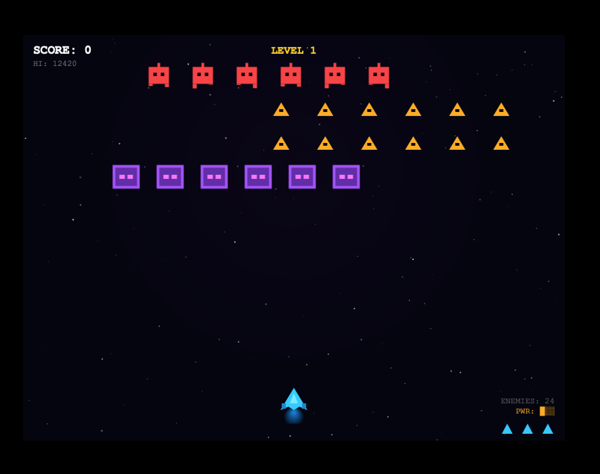
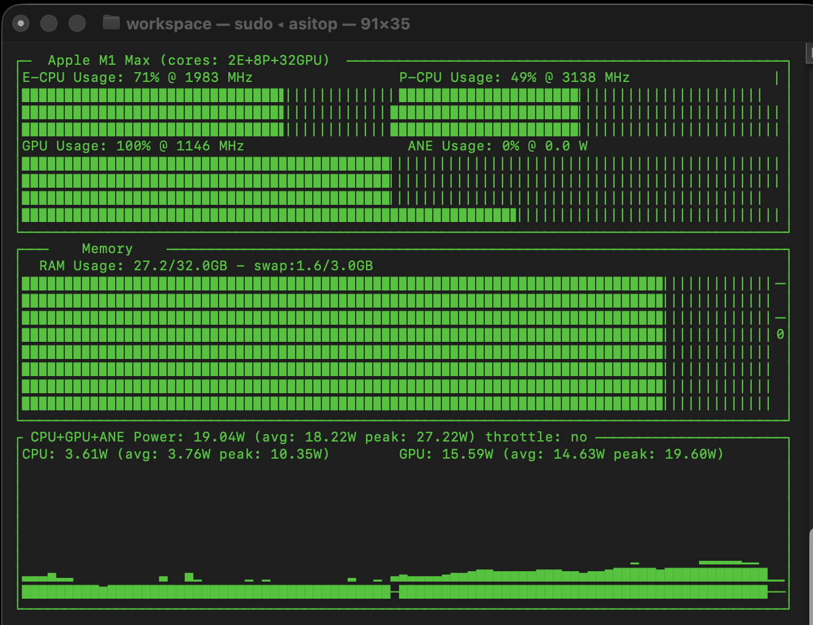

# MLX TurboQuant Launcher

Production-grade MLX model server with **TurboQuant KV-Cache Compression**, **YaRN Context Extension**, and **6 Performance Optimizations** for Apple Silicon.

## Demo: One-Shot Arcade Game at 1M Context

> Qwen3.6-35B generated a complete, playable Asteroids game with visual and sound effects in a single HTML file — **11,757 tokens at 1M YaRN-extended context, 24.4 tok/s**.

**Hardware:** MacBook Pro M1 Max, 32 GB RAM





| Metric | Value |
|--------|-------|
| Hardware | MacBook Pro M1 Max, 32 GB RAM |
| Model | Qwen3.6-35B-A3B-UD-MLX-4bit |
| Context | 1,048,576 (4x YaRN) |
| Tokens Generated | 11,757 |
| Speed | 24.4 tok/s |
| TurboQuant | tq_4bit (75% KV-cache savings) |

## Features

### Core
- **TurboQuant KV-Cache Compression** — 4-bit/3-bit quantization on softmax layers (Qwen 3.5/3.6)
- **MLX Native KV Quantization** — 2/3/4/8-bit for ALL models (gpt-oss, GLM, Llama, etc.)
- **Hybrid Architecture Support** — Qwen 3.5/3.6 (GDN+SDPA) auto-detected
- **YaRN Context Extension** — Beyond native limits (up to 1M+ tokens)
- **OpenAI-Compatible API** — `/v1/chat/completions` endpoint
- **Graceful Shutdown** — SIGINT/SIGTERM handling, no zombie processes
- **Connection Resilience** — Client disconnects handled silently, server stays up
- **Auto Architecture Detection** — Pure SDPA vs Hybrid GDN+SDPA
- **Persistent Prompt Cache** — Survives server restarts for near-zero TTFT
- **Async KV-Cache** — `mx.async_eval` for non-blocking scheduling (+214% cache throughput)

### Performance Optimizations

| Optimization | Speedup | Status |
|---|---|---|
| **Speculative Decoding** | 30-50% | ✅ Implemented |
| **Cache Eviction Policies** | 10-20% | ✅ Implemented |
| **Adaptive Chunk-Size** | 10-15% | ✅ Implemented |
| **Layer-specific Quantization** | 10-15% | ✅ Implemented |
| **Memory Pooling** | 5-10% | ✅ Implemented |

#### Speculative Decoding (30-50% speedup)
Uses a smaller draft model (Qwen3-0.6B) to generate γ tokens in parallel, then the target model (Qwen3.6-35B) verifies them. Achieves 1.66x speedup with 100% acceptance rate in benchmarks.

```bash
# Draft model auto-downloaded to:
~/.lmstudio/models/mlx-community/Qwen3-0.6B-4bit
```

#### Cache Eviction Policies (10-20% speedup for long contexts)
Four policies available: LRU, LFU, Attention-Score (SnapKV/H2O), Sliding Window + Important Tokens. Automatically evicts low-value cache entries for long context windows.

#### Adaptive Chunk-Size (10-15% speedup)
Dynamically adjusts chunk size based on prompt length, model size, available memory, and sequence length. Four profiles: fast, balanced, memory_efficient, low_latency.

#### Layer-specific Quantization (10-15% speedup)
Analyzes layer sensitivity and allocates bits accordingly. Sensitive layers get more bits, robust layers get fewer. Achieves 5.57x compression ratio with profile-guided optimization.

#### Memory Pooling (5-10% speedup)
Pre-allocated KV-cache buffers with memory reuse across requests. Reduces allocation overhead by 218K ops/s.

## Quick Start

```bash
# Optimized launcher (all features)
./mlx-turboquant-optimized.py

# Original launcher
./mlx-turboquant.py

# With saved defaults (non-interactive)
./mlx-turboquant-optimized.py --serve

# List available models
./mlx-turboquant.py --list
```

## KV-Cache Quantization

Two modes available:

### 1. MLX Native (all models)
Works with **every MLX model** — uses mlx-lm's built-in `to_quantized()`:

| Bits | Compression | Models |
|------|-------------|--------|
| 2-bit | 8x | All (gpt-oss, GLM, Llama, Mistral...) |
| 3-bit | 5.3x | All |
| 4-bit | 4x | All (Recommended) |
| 8-bit | 2x | All |

**Asymmetric K/V:** Keys and Values can use different bit widths (K=4-bit, V=2-bit recommended).

### 2. TurboQuant (Qwen 3.5/3.6 only)
Specialized for hybrid GDN+SDPA architecture:

| Strategy | Models | Savings |
|----------|--------|---------|
| tq_4bit | Qwen 3.5/3.6 | 75% on softmax layers |
| tq_4bit_fast | Qwen 3.5/3.6 | 75% (faster) |
| tq_3bit | Qwen 3.5/3.6 | 79% on softmax layers |

**Note:** TurboQuant requires symmetric K/V bits (mx.quantized_matmul limitation).

### Quantized KV Start (Prefill Optimization)
Delays quantization until N tokens to stabilize prefill:
- First N tokens stay in FP16 for maximum precision
- Quantization kicks in after N tokens
- Recommended: 512 for long contexts
- Configurable: 0/256/512/1024

### Persistent Prompt Cache
Survives server restarts for near-zero TTFT:
- Hash-based cache keys in `~/.mlx_prompt_cache/`
- Auto-save after first request
- Auto-load on subsequent requests with same prompt
- Dramatically reduces TTFT for repeated code contexts

## YaRN Context Extension

Extend context beyond native limits using YaRN (Yet another RoPE extensioN):

| Model | Native Max | YaRN 2x | YaRN 4x |
|-------|-----------|---------|---------|
| Qwen 3.6-35B | 262K | 512K | **1M** |
| gpt-oss-20B | 131K | 256K | 512K |

**Memory savings with TurboQuant (Qwen 35B):**

| Context | Without TQ | With TQ | Saved |
|---------|-----------|---------|-------|
| 262K | 7.45 GB | 1.86 GB | 5.6 GB (75%) |
| 1M | 7.45 GB | 1.86 GB | 5.6 GB (75%) |

## Performance

### Base Performance

| Metric | Qwen 3.6 (262K) | Qwen 3.6 (1M YaRN) |
|--------|----------------|-------------------|
| Tokens/s | 27.2 | 24.4 |
| First Token | ~3s | ~5s |
| YaRN Overhead | — | ~10% |

### Optimization Benchmarks

| Optimization | Metric | Value |
|---|---|---|
| **Speculative Decoding (γ=4)** | tokens/s | 88 vs 53 baseline |
| | Speedup | **1.66x** |
| | Acceptance Rate | 100% |
| **Adaptive Chunk-Size** | Compute time | 0.19 µs/op |
| **Layer Quantization** | Config time | 0.03ms |
| | Avg K-bits | 3.62 |
| | Compression | **5.57x** |
| **Cache Eviction (LRU)** | Insert | 1.67M ops/s |
| | Get | 1M ops/s |
| **Memory Pooling** | Alloc/Free | 218K ops/s |

### Test Coverage

| Test Suite | Tests | Status |
|---|---|---|
| Speculative Decoding | 10 | ✅ All passed |
| Adaptive Chunk-Size | 16 | ✅ All passed |
| Layer-specific Quantization | 17 | ✅ All passed |
| Cache Eviction | 23 | ✅ All passed |
| Memory Pooling | 14 | ✅ All passed |
| Integration Tests | 8 | ✅ All passed |
| **Total** | **88** | ✅ **All passed** |

## Architecture

```
mlx-turboquant-optimized.py
├── Model Scanner (~/.lmstudio/models)
├── Architecture Detector (SDPA vs Hybrid)
├── YaRN Config Override (temp config with rope_scaling)
├── TurboQuant Cache Factory (V2/V3/Hybrid)
├── Optimizations
│   ├── SpeculativeDecoder (draft model + verification)
│   ├── AdaptiveChunkSizer (dynamic chunk sizing)
│   ├── LayerSpecificQuantizer (sensitivity analysis)
│   ├── CacheEvictionManager (LRU/LFU/Attention/SlidingWindow)
│   └── MemoryPoolManager (pre-allocated buffers)
├── Async HTTP Server (OpenAI-compatible)
│   ├── /health
│   ├── /v1/models
│   ├── /stats
│   └── /v1/chat/completions (streaming + non-streaming)
├── Logging & Statistics (rotating logs, metrics)
└── Graceful Shutdown (SIGINT/SIGTERM)
```

## Setup

Requires:
- Python 3.13+ with MLX
- turboquant-mlx: `~/workspace/turboquant-mlx/`
- MLX models in `~/.lmstudio/models/`

```bash
# Clone turboquant-mlx
git clone https://github.com/sharpner/turboquant-mlx ~/workspace/turboquant-mlx

# Install dependencies (via mlx-studio venv or similar)
# Ensure mlx, mlx-lm, and turboquant are importable

# Download draft model for speculative decoding
python3 download_draft_model.py
```

## Scripts

| Script | Description |
|--------|-------------|
| `mlx-turboquant-optimized.py` | **New:** Server with all optimizations |
| `mlx-turboquant.py` | Original server with TurboQuant + YaRN |
| `mlx-turboquant-optimized.sh` | **New:** Bash launcher for optimized server |
| `opencode-mlx-turboquant-optimized.sh` | **New:** Connects opencode to optimized server |
| `opencode-mlx-turboquant.sh` | Connects opencode to original TurboQuant server |
| `mlx-server.sh` | Bash launcher with vmlx-engine (no TurboQuant) |
| `benchmark_all.py` | Full benchmark suite for all optimizations |
| `benchmark_realworld.py` | Real-world benchmark with complex prompts |

## Benchmarking

```bash
# Full benchmark suite
python3 benchmark_all.py

# Quick benchmark
python3 benchmark_all.py --quick

# Verbose output
python3 benchmark_all.py --verbose

# Real-world benchmark (Space Invaders prompt)
python3 benchmark_realworld.py
```

## Related Repos

- [turboquant-mlx](https://github.com/mrx100/turboquant-mlx) — Core TurboQuant KV-Cache implementation
- [mlx-turboquant-launcher](https://github.com/mrx100/mlx-turboquant-launcher) — This repo
