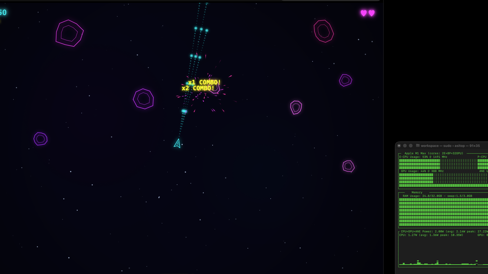

# MLX TurboQuant Launcher

Production-grade MLX model server with **TurboQuant KV-Cache Compression** and **YaRN Context Extension** for Apple Silicon.

## Demo: One-Shot Arcade Game at 1M Context

> Qwen3.6-35B generated a complete, playable Asteroids game with visual and sound effects in a single HTML file — **11,757 tokens at 1M YaRN-extended context, 24.4 tok/s**.



| Metric | Value |
|--------|-------|
| Model | Qwen3.6-35B-A3B-UD-MLX-4bit |
| Context | 1,048,576 (4x YaRN) |
| Tokens Generated | 11,757 |
| Speed | 24.4 tok/s |
| TurboQuant | tq_4bit (75% KV-cache savings) |

## Features

- **TurboQuant KV-Cache Compression** — 4-bit/3-bit quantization on softmax layers
- **Hybrid Architecture Support** — Qwen 3.5/3.6 (GDN+SDPA) auto-detected
- **YaRN Context Extension** — Beyond native limits (up to 1M+ tokens)
- **OpenAI-Compatible API** — `/v1/chat/completions` endpoint
- **Graceful Shutdown** — SIGINT/SIGTERM handling, no zombie processes
- **Connection Resilience** — Client disconnects handled silently, server stays up
- **Auto Architecture Detection** — Pure SDPA vs Hybrid GDN+SDPA

## Quick Start

```bash
# Interactive launcher
./mlx-turboquant.py

# With saved defaults (non-interactive)
./mlx-turboquant.py --serve

# List available models
./mlx-turboquant.py --list
```

## YaRN Context Extension

Extend context beyond native limits using YaRN (Yet another RoPE extensioN):

| Model | Native Max | YaRN 2x | YaRN 4x |
|-------|-----------|---------|---------|
| Qwen 3.6-35B | 262K | 512K | **1M** |
| gpt-oss-20B | 131K | 256K | 512K |

**Memory savings with TurboQuant (Qwen 35B):**

| Context | Without TQ | With TQ | Saved |
|---------|-----------|---------|-------|
| 262K | 7.45 GB | 1.86 GB | 5.6 GB (75%) |
| 1M | 7.45 GB | 1.86 GB | 5.6 GB (75%) |

## Performance

| Metric | Qwen 3.6 (262K) | Qwen 3.6 (1M YaRN) |
|--------|----------------|-------------------|
| Tokens/s | 27.2 | 24.4 |
| First Token | ~3s | ~5s |
| YaRN Overhead | — | ~10% |

## Architecture

```
mlx-turboquant.py
├── Model Scanner (~/.lmstudio/models)
├── Architecture Detector (SDPA vs Hybrid)
├── YaRN Config Override (temp config with rope_scaling)
├── TurboQuant Cache Factory (V2/V3/Hybrid)
├── Async HTTP Server (OpenAI-compatible)
│   ├── /health
│   ├── /v1/models
│   └── /v1/chat/completions (streaming + non-streaming)
└── Graceful Shutdown (SIGINT/SIGTERM)
```

## Setup

Requires:
- Python 3.13+ with MLX
- turboquant-mlx: `~/workspace/turboquant-mlx/`
- MLX models in `~/.lmstudio/models/`

```bash
# Clone turboquant-mlx
git clone https://github.com/sharpner/turboquant-mlx ~/workspace/turboquant-mlx

# Install dependencies (via mlx-studio venv or similar)
# Ensure mlx, mlx-lm, and turboquant are importable
```

## Scripts

| Script | Description |
|--------|-------------|
| `mlx-turboquant.py` | Main server with TurboQuant + YaRN |
| `mlx-server.sh` | Bash launcher with vmlx-engine (no TurboQuant) |
| `opencode-mlx-turboquant.sh` | Connects opencode to the TurboQuant server |
